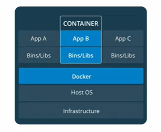
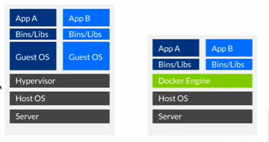

# 1: Dockek là gì?
- docker là ứng dụng mã nguồn mở.nó giúp cho chúng ta tạo ra các container để chúng ta phát triển triển khai ứng dụng. Hay có thể hiểu là nó cho ứng dụng chạy trong môi trường cách ly gọi là container.Chúng ta có thể xem container như là một máy ảo.
- Đây là mô hình mô tả hoạt động của docker:

=> Chúng ta có một máy vật lý trong(hay còn gọi là máy host) chúng ta dùng để cài docker. Khi docker chạy chúng ta muốn chạy một ứng dụng nào đó chạy trên môi trường của docker thì docker sẽ tạo ra một môi trường cách ly gọi là container. Trong các container nó chứa đầy đủ các thư viện, các gói ứng dụng nhằm đảm bảo cho ứng dụng của chúng ta hoạt động được trong docker. Docker có thể tạo ra nhiều container để chạy nhiều ứng dụng khác nhau. Giữa các container sẽ cách ly với nhau nên nó không có tương tác trực tiếp qua lại với nhau. Nó tương tự như việc chúng ta cài các máy ảo khác nhau dể chạy các ứng dụng khác nhau.
- VMs với Docker

