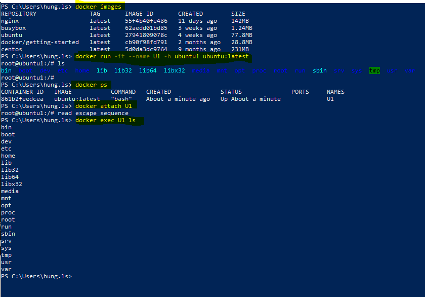
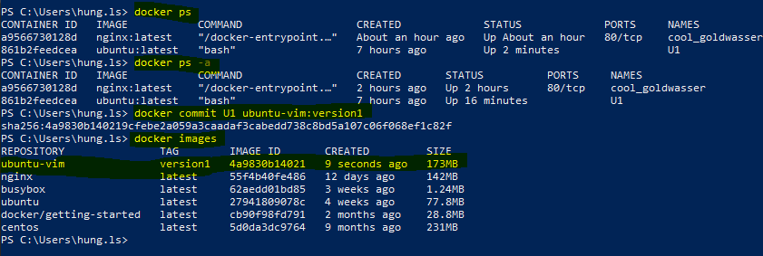
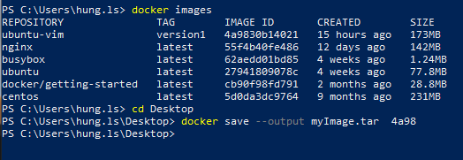
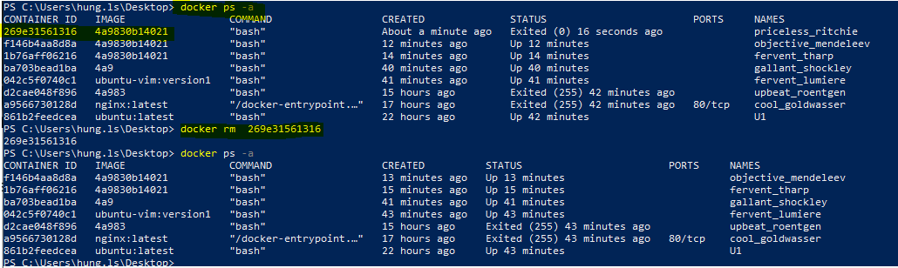
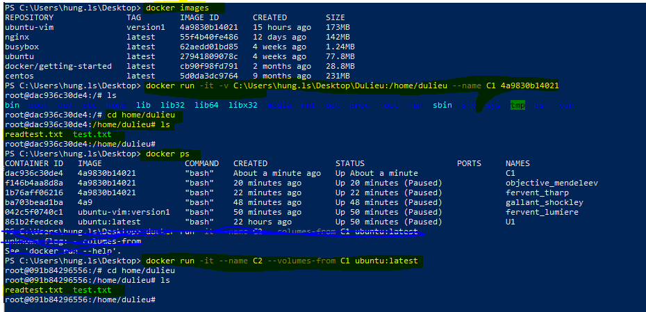
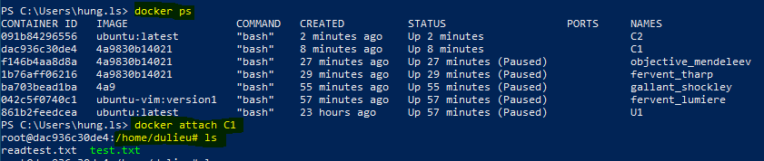
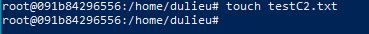
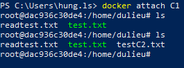
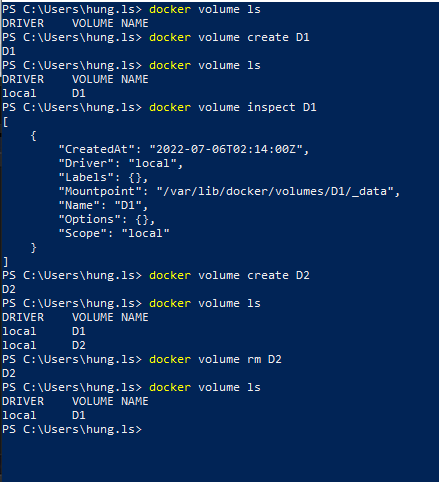
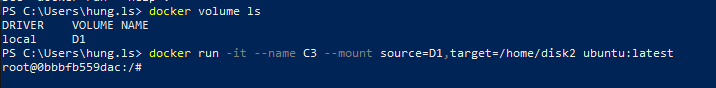

# 1:Lệnh Docker exec, lưu container thành image với commit, xuất image ra file
## 1.1:

- Cài đặt ping: root@ubuntu1:/# apt install iputils-ping
-  Chạy lệnh ping: root@ubuntu1:/# ping google.com
- Cài đặt Vim : root@ubuntu1:/# apt install vim
##1.1 Commit container thành Image:

- tiến hành commit: Vào thư mục màn hình desktop bằng lệnh cd

-  Bây giờ ngoài màn hình desktop sẽ có thư mục myImage.tar chúng ta vừa commit.
-  Chúng ta có thể sử dụng file Image này để chia sẽ cho nhiều máy tính.
-  Để sử dụng file image này chúng ta dùng lệnh: docker load -i myImage.tar
-  Chúng ta có thể đặt tên Repository và tag cho Image bằng lệnh sau: 
    docker tag IMAGE ID Tên_Repository:Tag 
# 2: Cách chia sẻ dữ liệu từ máy host cho container và giữa các container với nhau.
## 2.2: Cách chia sẻ dữ liệu từ máy host cho container
- Bây giờ chúng ta tạo một folder Dulieu  chứa tập tin test.txt trong tập tin này chứa nội dung là xin chào.
- Để container truy cập được dữ liệu này cũng như ghi được dữ liệu vào file này và sau đó chúng ta xóa container đi và thư mục này vẫn còn tồn tại trên máy host: 
   + Chúng ta tạo một container chứa trong images ubuntu-vim 
   docker run -it -v pathHost:pathContainer Imageid
   

- có thể sử dụng lện vi tenFile: để xem nội dung trong file 
## 2.2:  Cách chia sẻ dữ liệu giữa các container với nhau
-   Chúng ta tạo một container mới có tên là C1 : 
    +   docker run -it -v C:\Users\hung.ls\Desktop\DuLieu:/home/dulieu --name C1 4a9830b14021
-   Truy cập /home/dulieu# ls để xem các file có trong C1
-   Tạo thêm một container C2 có thể đọc và ghi file từ C1 :
    +   docker run -it --name C2 --columes-from C1 ubuntu:latest

-   Mở một Terminal mới chạy vô nhánh C1 

-   Tạo một file mới tên testC2.txt trên nhánh C2

-   Chạy lệnh ls trên nhánh C1 : /home/dulieu# ls và xem kết quả.

## 3:  tạo và quản lý ổ đĩa docker volume
-   Xem danh sách các ổ đĩa: docker volume ls
-   Tạo mới một ổ đĩa: docker volume create Tên_ổ_Đĩa
-   Xem thông tin ổ đĩa: docker volume inspect Tên_ổ_Đĩa
 

-   Bây giờ chúng ta muốn gán ổ đĩa cho một container đễ container build dữ liệu cố định trong đó:
    + docker run -it --mount source=DiSk,target= Path_Container_ImageID

-   Bây giờ chúng ta có thể lưu dữ liệu mà không sợ mất đi khi chúng ta xóa container.
