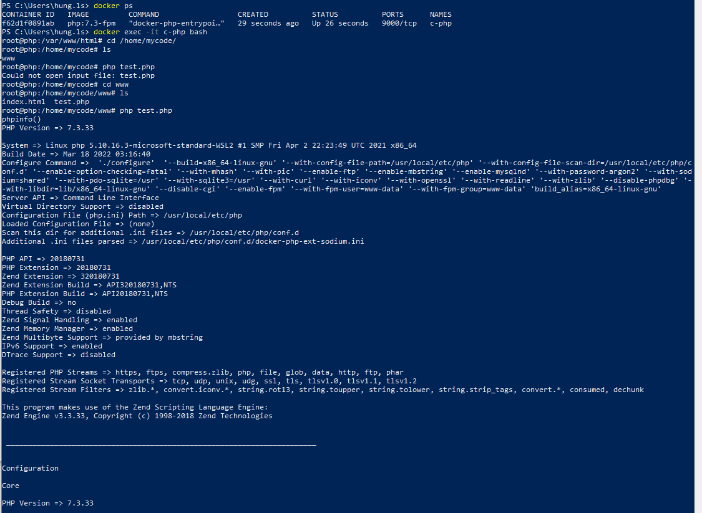

# 1: Cài đặt, tạo và chạy PHP, phiên bản có PHP-FPM bằng Docker
-  Kéo Image Php về và cài đặt network:

- Tạo một thư mục chưa code tên là myCode trong thư mục này tạo thư mục www và trong này tạo một file index.html
- Kiểm tra các image đã cài đặt: docker images
- Cài đặt Image php:  docker pull php:7.3-fpm
- Tạo các network : docker network create --driver bridge www-net
- Xem danh sách Network: docker network ls
- Chạy docker run -d --name c-php -h php -v /mycode/:/home/mycode/ --network www-net php:7.3-fpm
- Chạy docker ps để kiểm tra

- Vào c-php: docker exec -it c-php bash
- Vào thư mục cd /home/mycode/
- Vào thư mục myCode vào www Tạo file test.php với nội dung sau: 
<?php
    phpinfo();
- Vào lại chạy  php test.php

- Kiểm tra phiên bản php: php -version
# 2: Cài đặt, chạy Apache HTTPD bằng Docker
