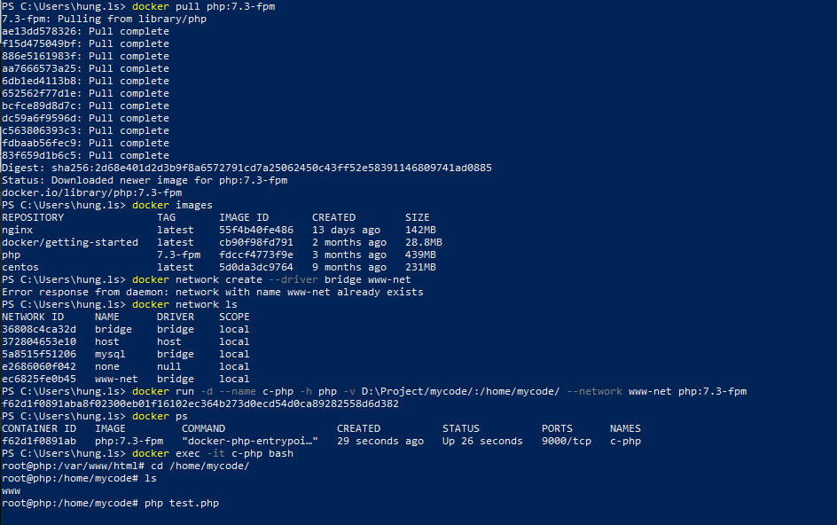

# 1: Cài đặt, tạo và chạy PHP, phiên bản có PHP-FPM bằng Docker


-  Kéo Image Php về và cài đặt network:


- Tạo một thư mục chưa code tên là myCode trong thư mục này tạo thư mục www và trong này tạo một file index.html
- Kiểm tra các image đã cài đặt: docker images
- Cài đặt Image php:  docker pull php:7.3-fpm
- Tạo các network : docker network create --driver bridge www-net
- Xem danh sách Network: docker network ls
- Chạy docker run -d --name c-php -h php -v /mycode/:/home/mycode/ --network www-net php:7.3-fpm
- Chạy docker ps để kiểm tra



- Vào c-php: docker exec -it c-php bash
- Vào thư mục cd /home/mycode/
- Vào thư mục myCode vào www Tạo file test.php với nội dung sau: 
```Dockerfile
<?php
    phpinfo();
```
- Vào lại chạy  php test.php


- Kiểm tra phiên bản php: php -version
# 2: Cài đặt, chạy Apache HTTPD bằng Docker
-   Khi máy chủ apache httpd chạy thì nó sẽ nạp file cấu hình ở đường dẫn user/local/apache2/conf/httpd.conf
-   Cài đặt httpd: docker pull httpd
-   lấy file hrrpd.conf lấy file này ra máy host.
    +   Chạy xong xóa luôn: --rm
    +   Coppy  httpd.conf từ /usr/local/apache2/conf/httpd.conf vào thư mục /home/mycode/:
        cp /usr/local/apache2/conf/httpd.conf /home/mycode/
-   Xem danh sách container : docker ps
-   Cài đặt httpd của apache : docker pull httpd
-   Xem các Image hiện có : docker images
-   Chạy  docker run --rm -v D:\Project/mycode/:/home/mycode/ httpd cp /usr/local/apache2/conf/httpd.conf /home/mycode/
-   Chạy code D:\Project/mycode/httpd.conf để mở file trên vysual code


-   Kiểm tra bên trong thư mục D:\Project/mycode/ có thêm file httpd.conf

-   Tất cả các máy chủ http mà chúng ta tạo ra  nó sẽ chạy file PHP thông qua Proxy tức là khi chúng ta truy vấn tới các file có phần mở rộng là php thi apache sẽ yêu cầu server chạy SPM thi hành file PHP đó.
-   Để sử dụng được Proxy cho Apache chúng ta phải nạp các module Proxy như 
    +   mod_proxy_connect.so và mod_proxy.so


    +   mod_proxy_fcgi.so
    


    +   Thiết lập PHP handler yêu cầu apache gọi chạy php thông qua Proxy: AddHandler "proxy:fcgi://c-php:9000" .php
    


-   Thiết lập thư mục làm việc mặc định của php


-   Vào file test.php ở máy host
```Dockerfile
<?php
    echo "Apache httpd";
    phpinfo();
```
-   Vào file index.html ở máy host
```Dockerfile
<?php
   <!DOCTYPE html>
<html lang="en">
<head>
    <meta charset="UTF-8">
    <meta http-equiv="X-UA-Compatible" content="IE=edge">
    <meta name="viewport" content="width=device-width, initial-scale=1.0">
    <title>Document</title>
</head>
<body>
    <h1>this is website runing on container</h1>
</body>
</html>
```
-   File httpd.conf đã sữa up trong kho chứa này của git.
-   Xem các network hiện có:  docker network ls
-   chạy lệnh trong dấu nháy:
```Dockerfile
docker run --network www-net --name c-httpd -h httpd -p 9999:80 -p 443:443 -v D:\Project/mycode/:/home/mycode/ -v           D:\Project/mycode/httpd.conf:/usr/local/apache2/conf/httpd.conf httpd
```


-   ra trình duyệt chạy theo cổng sau :


-   ra trình duyệt chạy theo cổng sau xem php đã hoạt động chưa :


-   Server API được gọi qua FPM/FastCGI.
# 3: Cài đặt, chạy MySQL bằng Docker

